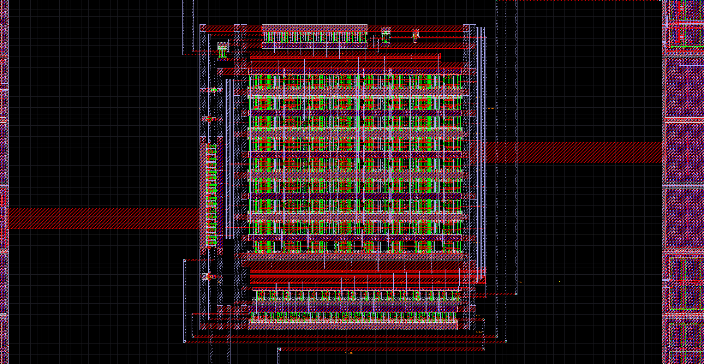
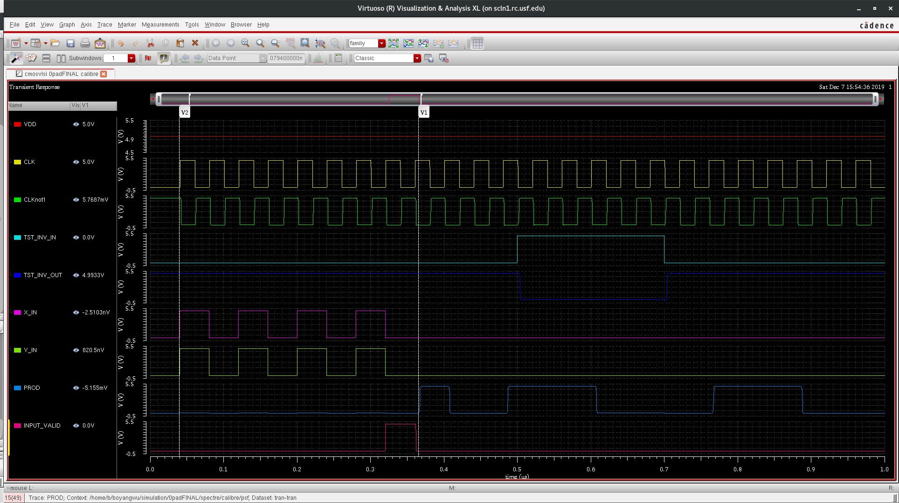
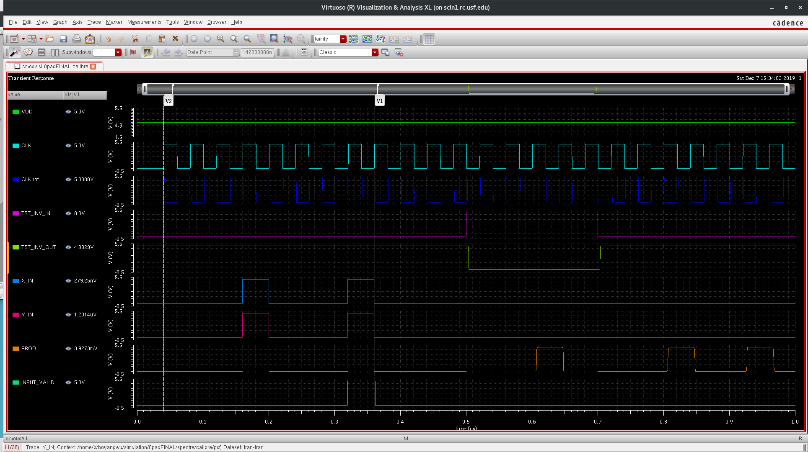
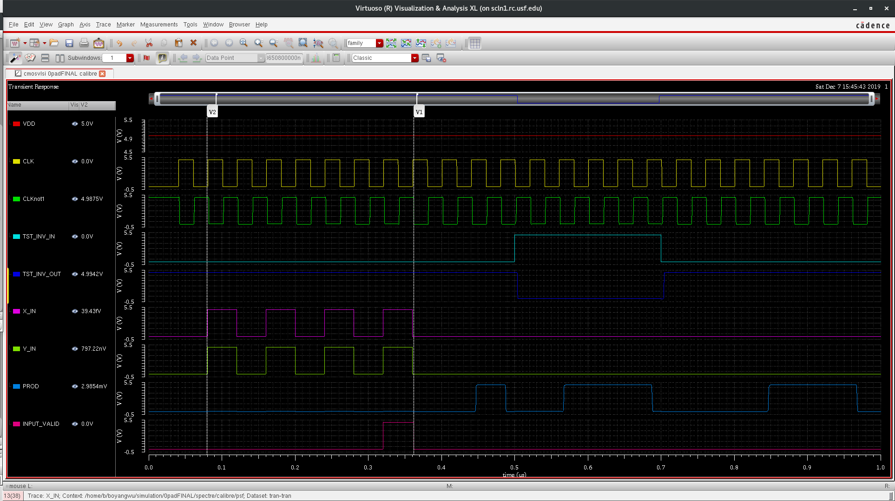
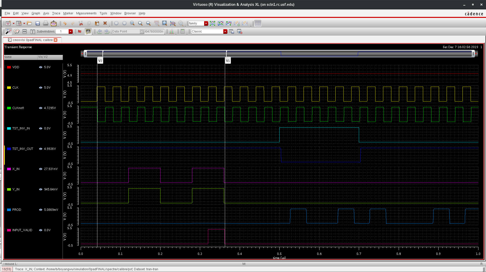
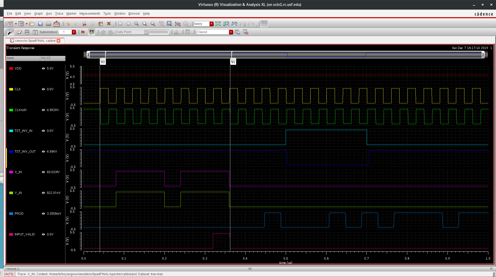
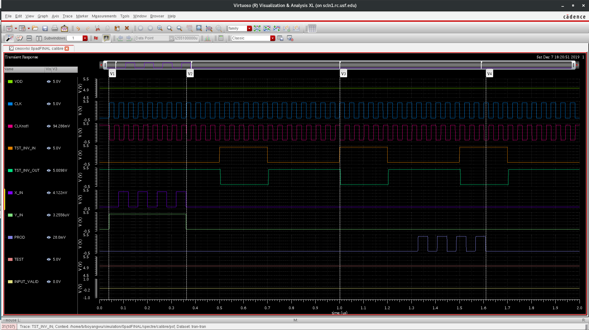

# 8x8 Multiplier in Cadence Virtuoso

Click [HERE](https://github.com/bowuu/CMOS-VLSI-Design) to learn more!

Click [HERE](https://github.com/bowuu/8x8-Multiplier/tree/master/CadenceAll) for all layouts!

# Final Layout

## 8x8 Multiplier in Padframe

## Padframe Zoom

# Output Waveforms

## Test Waveforms
Rationale for using the below numbers was to have as many numbers as possible change through the 8x8 multiplier, and thus testing functionality of all parts. 

## 01010101 x 01010101 = 0001110000111001 (85 x 85 = 7225)

## 10001000 x 10001000 = 0100100001000000 (136 x 136 = 18496)

## 10101010 x 10101010 = 0111000011100100 (170 x 170 = 28900)

## 11001100 x 11001100 = 1010001010010000 (204 x 204 = 41616)

## 11101110 x 11101110 = 1101110101000100 (238 x 238 = 56644)

## 11110000 x 11110000 = 1110000100000000 ( 240 x 240 = 57600)

## 11111111 x 10101010 = 1010100101010110 (255 x 170 = 43350)

## 11111111 x 11111111 = 1111111000000001 (255 x 255 = 65025)

## Test Mode Full (Serial through shift registers)

## Test Mode Zoomed In (Serial through shift registers)

## HSPICE

[Part 1](https://github.com/bowuu/8x8-Multiplier/tree/master/HSPICE%20Part%201)

[Part 2](https://github.com/bowuu/8x8-Multiplier/tree/master/HSPICE%20Part%202)

## Virtuoso

[Part 1](https://github.com/bowuu/8x8-Multiplier/tree/master/Cadence%20Part%201)

[Part 2](https://github.com/bowuu/8x8-Multiplier/tree/master/Cadence%20Part%202)

[Part 3](https://github.com/bowuu/8x8-Multiplier/tree/master/Cadence%20Part%203)

[Complete](https://github.com/bowuu/8x8-Multiplier/tree/master/8x8%20Multiplier)

## Description

Design an ASIC implementation of an 8x8 Multiplier. 
