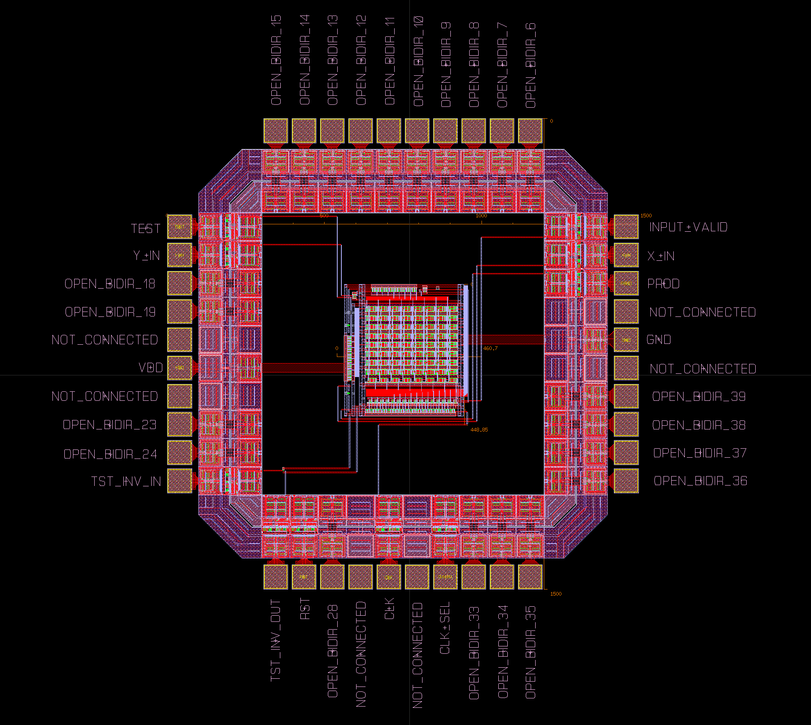

# 8x8 Multiplier in Cadence Virtuoso

Click [HERE](https://github.com/bowuu/CMOS-VLSI-Design) to learn more!

# Final Layout

## 8x8 Multiplier in Padframe

## Padframe Zoom

## Output Waveforms
Click [HERE](https://github.com/bowuu/8x8-Multiplier/tree/master/Waveforms)

## HSPICE

[Part 1](https://github.com/bowuu/8x8-Multiplier/tree/master/HSPICE%20Part%201)

[Part 2](https://github.com/bowuu/8x8-Multiplier/tree/master/HSPICE%20Part%202)

## Virtuoso

[Part 1](https://github.com/bowuu/8x8-Multiplier/tree/master/Cadence%20Part%201)

[Part 2](https://github.com/bowuu/8x8-Multiplier/tree/master/Cadence%20Part%202)

[Part 3](https://github.com/bowuu/8x8-Multiplier/tree/master/Cadence%20Part%203)

[Complete](https://github.com/bowuu/8x8-Multiplier/tree/master/8x8%20Multiplier)

## Description

