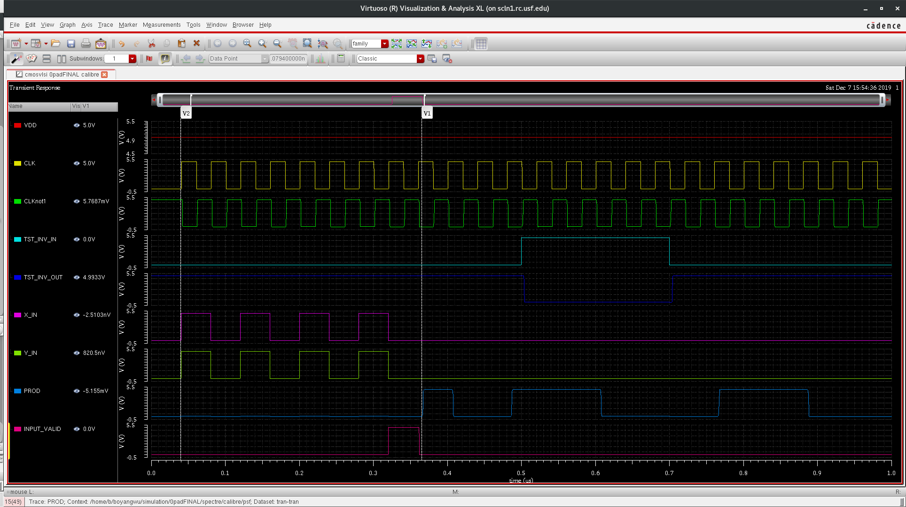
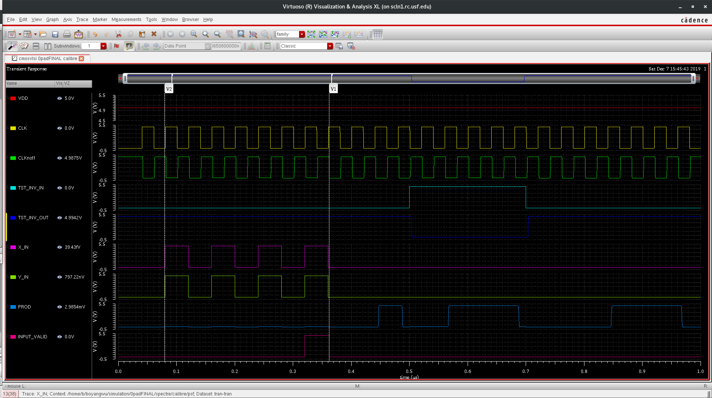
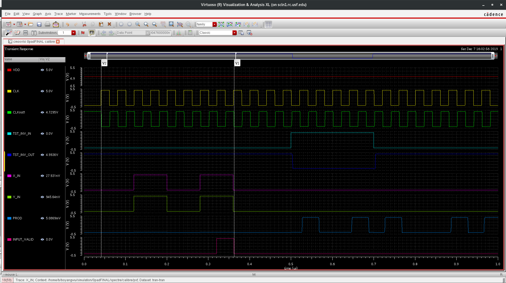
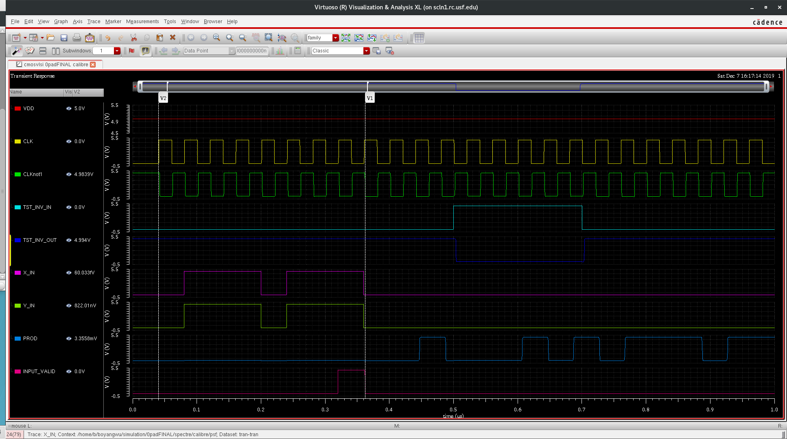
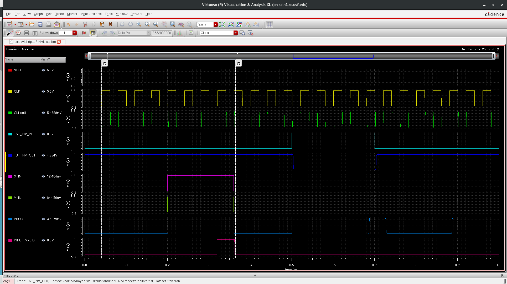
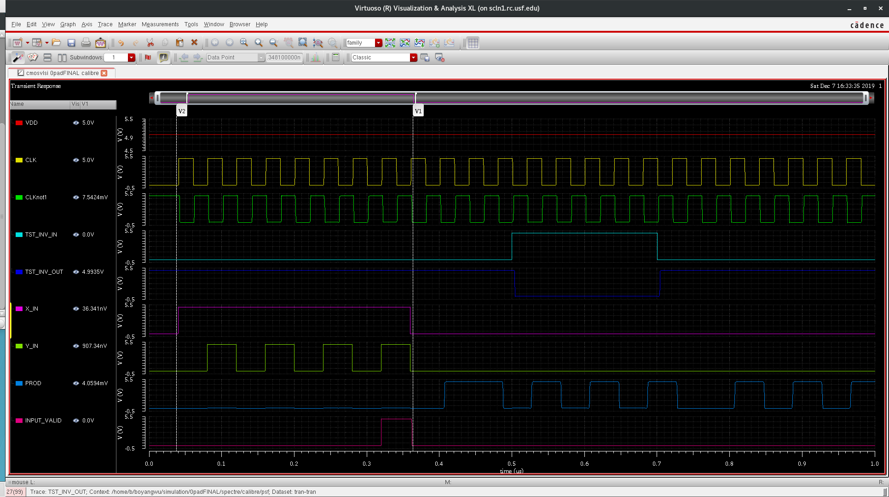
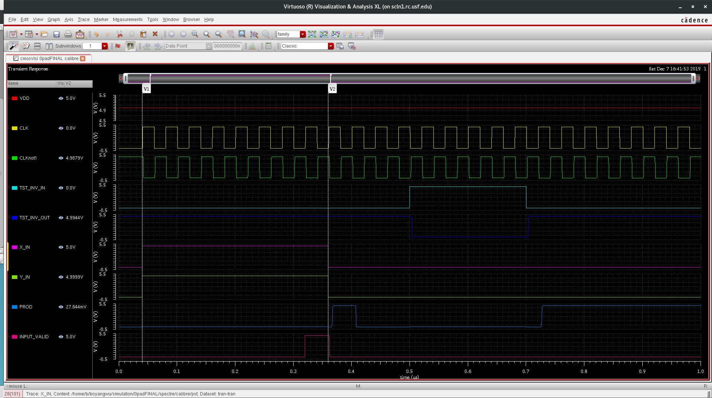
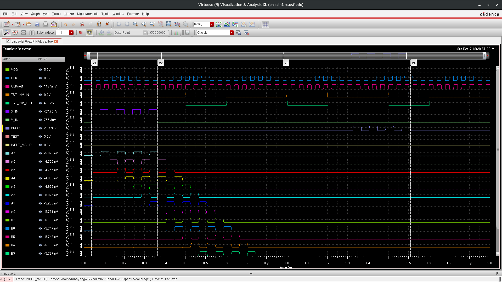
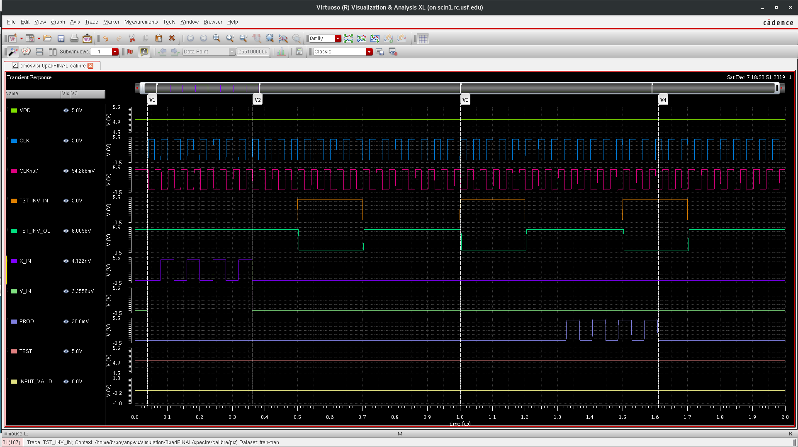

# Test Waveforms

## 01010101 x 01010101 = 0001110000111001 (85 x 85 = 7225)

## 10001000 x 10001000 = 0100100001000000 (136 x 136 = 18496)

## 10101010 x 10101010 = 0111000011100100 (170 x 170 = 28900)

## 11001100 x 11001100 = 1010001010010000 (204 x 204 = 41616)

## 11101110 x 11101110 = 1101110101000100 (238 x 238 = 56644)

## 11110000 x 11110000 = 1110000100000000 ( 240 x 240 = 57600)

## 11111111 x 10101010 = 1010100101010110 (255 x 170 = 43350)

## 11111111 x 11111111 = 1111111000000001 (255 x 255 = 65025)

## Test Mode Full (Serial through shift registers)

## Test Mode Zoomed In (Serial through shift registers)

